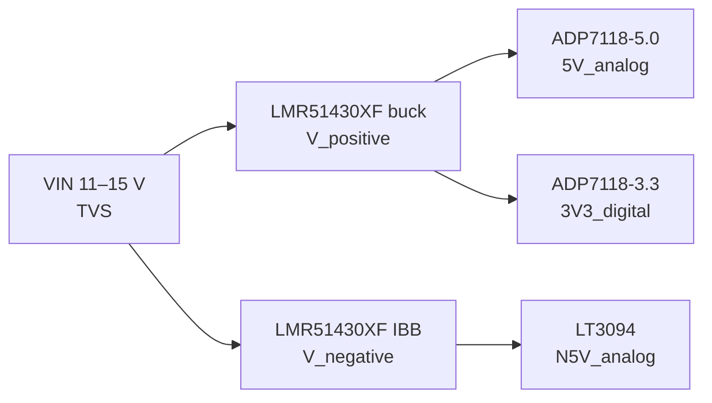
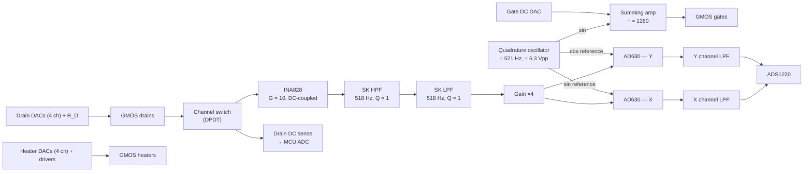
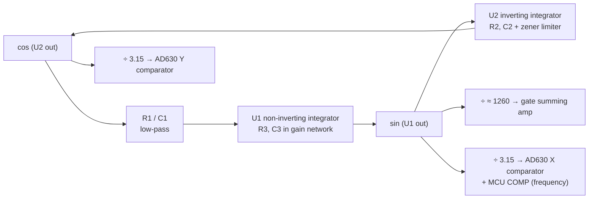

# GMOS LIA Readout Board
 
KiCad project implementing the PCB for the GMOS readout based on the lock-in amplifier (LIA) approach. The board replaces the bench setup (SR860 lock-in + SR560 pre-amplifier + lab supplies) used for the 3T differential measurement of the GMOS active/blind transistor pair.
 
> **Legend:** `TODO` marks design work still to be done. `ASSUMPTION` marks a value used for sizing that must be confirmed.
 
---
 
## Table of Contents
 
1. [Schematic Overview](#1-schematic-overview)
2. [Measurement Principle & Design Considerations](#2-measurement-principle--design-considerations)
3. [DC (Power) Section](#3-dc-power-section)
4. [Analog Section](#4-analog-section)
5. [Digital Section](#5-digital-section)
6. [Power Budget](#6-power-budget)
7. [Simulation](#7-simulation)
8. [Lab Tests](#8-lab-tests)
9. [Open Items](#9-open-items)
10. [References](#10-references)
---
 
## 1. Schematic Overview
 
The schematic is split into the following sheets:
 
| Sheet | Content |
|-------|---------|
| 1 | Connectors, GMOS socket |
| 2 | Analog readout section |
| 3 | Digital readout section |
| 4 | DC (power) section |
 
---
 
## 2. Measurement Principle & Design Considerations
 
### 2.1 Device and Sensing Mechanism
 
The GMOS is a micromachined CMOS-SOI pixel containing a transistor (29 nMOS devices in parallel, W = 204 µm, L = 4.15 µm) and an integrated heating resistor. Each package provides two usable differential channels, each composed of an **active** pixel (exposed, with catalytic layer) and a **blind** pixel (inert reference).
 
Gas combustion on the catalytic layer releases heat, raising the active pixel temperature by ΔT. This shifts the threshold voltage and subthreshold drain current of the active transistor relative to the blind one, and the difference appears as a differential signal between the two drain nodes. Because the blind pixel sees the same heater, ambient and supply conditions, common-mode drifts are rejected by the differential readout.
 
### 2.2 3T Readout Method
 
Each transistor is operated in a three-terminal configuration:
 
- **Gate:** DC bias plus a small sine excitation at the lock-in reference frequency.
- **Drain:** connected through a series load resistor R_D (≈ 330 kΩ) to a programmable supply.
- **Heater:** DC voltage, trimmed per pixel to equalize the drain currents of the active/blind pair.
The gate modulation δV_GS produces a drain-current modulation g_m·δV_GS, which R_D converts to a voltage. The lock-in output is therefore proportional to the differential transconductance:
 
$$
\Delta v_{d} = -(g_{m,A} - g_{m,B})\cdot \delta V_{GS}\cdot R_D
$$
 
The minus sign reflects the inverting common-source stage. The phase θ carries information on reactive elements in the signal path and is used for calibration.
 
### 2.3 Bench Setup → Board Block Mapping
 
| Bench instrument / setting | Board block | Notes |
|----------------------------|-------------|-------|
| SR860 reference out, 990 mV offset | Gate DC DAC + scaling op-amp + summing amp | Board range 0.97–1.2 V |
| SR860 reference out, 5 mVrms (≈ 14.1 mVpp) | Quadrature oscillator (518 Hz) + attenuating summing amp | Board: 5 mVpp |
| Lab supply on drain resistors | Drain DACs + scaling op-amps + R_D | Board range 2.7–3.5 V |
| Lab supply on heaters (2.7–2.9 V) | Heater DACs + driver op-amps | Board range 2.5–4.0 V |
| SR560: differential input, gain 20 V/V, BPF 300 Hz–1 kHz (6 dB/oct) | INA (G = 10, DC-coupled) → SK HPF → SK LPF → ×4 | Board: 40 V/V, 377–711 Hz (12 dB/oct) |
| SR860 demodulator (X, Y, R, θ) | AD630 pair + post-LPF (τ = 500 ms) + 24-bit ADC; R, θ computed in MCU/PC | |
 
As on the bench (SR560 differential input stage, then filters), the differential conversion happens first and the filtering is done once on the difference signal.
 
### 2.4 Transistor Operating Point
 
The GMOS must operate in subthreshold (weak inversion), where the temperature coefficient of the current is maximal. Two conditions must hold simultaneously:
 
$$
V_{GS} < V_T \approx 1.33\ \mathrm{V}, \qquad V_{DS} > \frac{3 k_B T}{q}
$$
 
The second condition must be evaluated at the **pixel** temperature:
 
| Pixel temperature | 3·k_B·T/q |
|-------------------|-----------|
| 300 K | 77.6 mV |
| 400 K | 103.4 mV |
| 573 K (300 °C) | 148.1 mV |
| 673 K (400 °C) | 174.0 mV |
 
The quiescent drain voltage (source grounded) is
 
$$
V_{DS} = V_{\mathrm{supply}} - I_{DS}\,R_D
$$
 
With I_DS = 5–10 µA and R_D = 330 kΩ the drain node sits at 50–250 mV. The 50 mV lower bound is kept so that the transistors can also be characterized with the heaters off (pixel at room temperature). At elevated pixel temperature the firmware keeps V_DS above the value in the table.
 
**AC drain swing.** The 3T stage is a common-source amplifier. Assuming r_0 ≫ R_D, with g_m = I_DS/(n·k_B·T/q):
 
$$
v_{d,pp} \approx g_m R_D\cdot \delta V_{GS,pp} = \frac{I_{DS} R_D}{n\cdot k_B T/q}\cdot \delta V_{GS,pp}
$$
 
| Pixel temperature | I_DS·R_D = 1.65 V (5 µA) | I_DS·R_D = 3.3 V (10 µA) |
|-------------------|--------------------------|--------------------------|
| 300 K | gain ≈ 40 → ≈ 200 mVpp | gain ≈ 80 → ≈ 400 mVpp |
| 673 K | gain ≈ 18 → ≈ 90 mVpp | gain ≈ 36 → ≈ 180 mVpp |
 
> (n = 1.6, δV_GS = 5 mVpp.) 
 
This is an upper bound. A finite r_0 lowers it. The bench data ([§2.5](#25-expected-signal-level-from-bench-data)) suggests the real stage gain is lower than this estimate. For clean small-signal operation the swing must also respect the V_DS limit:
 
$$
V_{DS,\mathrm{DC}} - \frac{v_{d,pp}}{2} > \frac{3 k_B T}{q}
$$
 
The drains carry this signal as **common mode** (both transistors share the gate excitation), which the readout must reject ([§2.7](#27-common-mode-rejection)).
 
The gate excitation must remain a small signal relative to n·k_B·T/q ≈ 41 mV (300 K) to 93 mV (673 K); 5 mVpp satisfies this.
 
### 2.5 Expected Signal Level (from Bench Data)
 
The SR860 reports X, Y and R as rms values of the input component at the reference frequency. Bench measurements gave at most 400 mV on X/Y with the SR560 at 20 V/V and a 5 mVrms excitation, so:
 
| Quantity | Bench (5 mVrms ≈ 14.1 mVpp excitation) | Board (5 mVpp excitation) |
|----------|-----------------------------------------|---------------------------|
| Differential drain signal, rms | 400 mV / 20 = 20 mVrms | 7.1 mVrms |
| Differential drain signal, peak | 28.3 mV | 10.0 mV |
| Differential drain signal, peak-to-peak | 56.6 mVpp | 20.0 mVpp |
 
The board value scales by the excitation ratio (5 mVpp / 14.1 mVpp = 0.354). The bench figure is consistent with the device physics: it corresponds to a Δg_m/g_m of the order of 10–20 % of the drain swing, and the fact that the ideal r_0 ≫ R_D swing at bench excitation (0.6–1.1 Vpp) could not fit inside a 50–250 mV drain DC level indicates a lower real stage gain. The chain gain ([§2.9](#29-gain-distribution-headroom-and-demodulator-output)) is set from the **board** column with 2× headroom.
 
- [ ] TODO: Confirm on the bench: drain AC swing per drain (oscilloscope) and maximum X/Y at the planned operating points ([LAB-1](#lab-1-drain-node-waveforms-oscilloscope), [LAB-2](#lab-2-bench-lock-in-reference-levels-sr560--sr860)).
### 2.6 Front End: Differential Conversion First
 
The two drains (of the channel selected by the DPDT switch) go directly to a DC-coupled instrumentation amplifier (INA828, G = 10), followed by a single band-pass (Sallen-Key HPF + Sallen-Key LPF) and a ×4 gain stage.
 
**Drain loading.** The transistor behaves as an AC current source g_m·δV_GS feeding the drain node, and everything attached to the node is in parallel for that current:
 
$$
v_d = g_m\cdot \delta V_{GS}\cdot \left(R_D \parallel r_0 \parallel Z_{\mathrm{in}}\right)
$$
 
A Sallen-Key filter connected directly to the drain would present Z_in of a few kΩ to tens of kΩ and attenuate the signal by tens of times. The INA828 inputs are high-impedance (GΩ-level resistance, pA-to-sub-nA bias current, a few pF; verify against the datasheet), so Z_in ≫ R_D and the loading problem disappears without dedicated buffers. What remains is the drain-node capacitance (INA input + switch + traces, assumed ≈ 20 pF), which forms a pole with R_D:
 
$$
f_p = \frac{1}{2\pi R_D C_{\mathrm{node}}} \approx 24\ \mathrm{kHz}
$$
 
far above 518 Hz; only its mismatch between the two drains matters ([§2.7](#27-common-mode-rejection)). The input bias current flows through R_D and shifts each drain DC level by I_B·R_D (≤ ≈ 0.3 mV for 1 nA), which is calibrated by the drain-voltage measurement.
 
**DC headroom.** The INA is DC-coupled, so it amplifies the DC mismatch between the drains: ±200 mV mismatch → ±2 V at the INA output, inside its swing on ±5 V. The HPF removes it before the ×4 stage. Requirement: drain DC mismatch ≤ ±200 mV (set by the heater/drain trim).
 
**Noise.** R_D sets the dominant white-noise floor:
 
$$
e_{n,R_D} = \sqrt{4 k_B T R_D} \approx 74\ \mathrm{nV/\sqrt{Hz}}, \qquad \sqrt{2}\,e_{n,R_D} \approx 105\ \mathrm{nV/\sqrt{Hz}}\ \text{(differential)}
$$
 
The INA828 at G = 10 contributes ≈ 11 nV/√Hz input-referred (7 nV/√Hz input stage, 90 nV/√Hz output stage ÷ 10; datasheet typical values). Filter and gain-stage noise is divided by 10 when referred to the input and is negligible.
 
**1/f noise and reference frequency.** The transistor 1/f corner is ≈ 200 Hz at typical I_DS, below the band-pass −3 dB edge (377 Hz). 518 Hz lies between the 10th (500 Hz) and 11th (550 Hz) mains harmonics and well above the pixel thermal bandwidth (≈ 16 Hz).
 
**DC leakage on the drain nodes.** Any DC current drawn from the node produces an offset (1 nA → 330 µV). Use guard rings and keep-outs around the drain traces, and the low-leakage switch (AN-29c).
 
**Load resistor quality.** R_D sets both the signal gain and the CMRR ([§2.7](#27-common-mode-rejection)). Use 0.1 %, ≤ 25 ppm/°C thin-film resistors, placed together so the active and blind resistors track thermally.
 
### 2.7 Common-Mode Rejection
 
With the INA first, the CM-to-DM conversion comes from mismatch between the two drain nodes (R_D and node capacitance), not from the filters. Monte-Carlo, 50 000 trials (Python; 60-run cross-check in SPICE, [§7](#7-simulation)):
 
| R_D tolerance | C_node (20 pF) mismatch | INA CMRR | System CMRR median | 99 % worst |
|---------------|-------------------------|----------|--------------------|------------|
| 0.05 % | ±5 % | 90 dB | 62 dB | 54 dB |
| **0.1 %** | **±10 %** | **90 dB** | **56 dB** | **48 dB** |
| 0.1 % | ±20 % | 90 dB | 52 dB | 42 dB |
| 1 % | ±10 % | 90 dB | 44 dB | 35 dB |
| 0.1 % | ±10 % | 80 dB | 56 dB | 48 dB |
 
A realistic system CMRR is therefore ≈ 50–60 dB, limited by R_D matching and by keeping the two drain-node layouts symmetric (equal trace lengths, same switch channel type). The INA's own CMRR (80–90 dB+) does not limit it. At 56 dB, a 300 mVpp common-mode drain swing leaks as ≈ 0.5 mVpp apparent differential signal, ≈ 2.5 % of the expected 20 mVpp board signal; the capacitive part appears mostly in quadrature (Y).
 
### 2.8 Band-Pass Filter Design
 
The band-pass is a 2nd-order unity-gain Sallen-Key high-pass followed by a 2nd-order unity-gain Sallen-Key low-pass, both tuned to f_0 = 518 Hz with Q = 1. At f_0 the high-pass contributes +90° and the low-pass −90°, so the filter has **unity gain and 0° phase at the reference frequency**, with 40 dB/decade slopes on each side.
 
$$
H(s) = \frac{(s/\omega_0)^2}{(s/\omega_0)^2 + \frac{s}{Q\omega_0} + 1}\cdot\frac{1}{(s/\omega_0)^2 + \frac{s}{Q\omega_0} + 1}, \qquad \omega_0 = 2\pi\cdot 518\ \mathrm{Hz}
$$
 
Trade-off between section Q, bandwidth and sensitivity to oscillator drift (±1 %):
 
| Section Q | Gain at f_0 | −3 dB band | Rel. attenuation 50 Hz / 150 Hz / 1036 Hz (2f) / 1554 Hz (3f) | Phase change over ±1 % frequency |
|-----------|-------------|------------|----------------------------------------------------------------|----------------------------------|
| 0.707 (HP 400 Hz, LP 670 Hz) | 0.74 | 318–843 Hz | −34 / −15 / −6 / −12 dB | 2.9° |
| **1 (selected)** | **1.00** | **377–711 Hz** | **−41 / −21 / −10 / −18 dB** | **4.6°** |
| 1.5 | 2.25 | 419–641 Hz | −48 / −27 / −16 / −25 dB | 6.9° |
| 2 | 4.0 | 441–608 Hz | −53 / −32 / −20 / −29 dB | 9.2° |
 
Q = 1 is selected because higher Q increases the phase sensitivity to oscillator drift (θ moves with frequency) while the extra attenuation is modest. R is insensitive to the ±1 % drift (< 0.01 dB).
 
Component relations for unity-gain Sallen-Key sections (derived symbolically; ratio 4Q² = 4 for Q = 1):
 
| Section | Components | Relations | Values |
|---------|------------|-----------|--------|
| HPF | C1 = C2 = C (series), R_f (cap junction → output), R_g (+input → ground) | Q = ½·√(R_g/R_f), R_f = 1/(2·Q·ω_0·C), R_g = 4Q²·R_f | C = 33 nF, R_f = 4.64 kΩ, R_g = 18.56 kΩ (4 × 4.64 kΩ in series) |
| LPF | R1 = R2 = R (series), C1 (junction → output), C2 (+input → ground) | Q = ½·√(C1/C2), C2 = 1/(2·Q·ω_0·R), C1 = 4Q²·C2 | R = 4.64 kΩ, C2 = 33 nF, C1 = 132 nF (4 × 33 nF in parallel) |
 
Building the 4:1 ratios from identical parts keeps the ratio tracking over temperature and tolerance. Use C0G/NP0 1 % capacitors and 0.1 % thin-film resistors. Tolerance spread at f_0 (Monte-Carlo):
 
| Components | Gain σ | Gain 99 % range | Phase σ | Phase 99 % range |
|------------|--------|-----------------|---------|------------------|
| R 0.1 %, C 1 % (C0G) | 0.06 dB | ±0.14 dB | 0.66° | ±1.6° |
| R 1 %, C 5 % | 0.31 dB | ±0.72 dB | 3.4° | ±8.2° |
 
The board-to-board phase offset is removed by the phase calibration ([§2.13](#213-calibration-considerations)).
 
### 2.9 Gain Distribution, Headroom and Demodulator Output
 
The AD630 runs on the ±5 V analog rails, its minimum supply. At ±5 V its datasheet ranges are [[D4]](#ref-d4):
 
- **Signal inputs:** (−V_S + 4) to (+V_S − 1) = **−1 V to +4 V**. The usable symmetric swing is therefore ±1 V; the design limit is ±0.8 V peak.
- **Comparator inputs:** (−V_S + 3) to (+V_S − 1.5) = **−2 V to +3.5 V**. The sin/cos references (≈ 6.3 Vpp from the oscillator, [§4.5](#45-quadrature-oscillator-design)) are attenuated to ≈ 2 Vpp (±1 V) by a 21.5 kΩ / 10 kΩ divider before the comparator inputs. With a ±1.5 mV switching window, a 1 V-peak reference gives a zero-crossing error of ≈ 0.5 µs (≈ 0.09°).
Gain distribution:
 
| Stage | Gain | Expected max (board, [§2.5](#25-expected-signal-level-from-bench-data)) | Linear limit |
|-------|------|-----------------------------|--------------|
| Drain differential | — | 10 mV peak | 20 mV peak (40 mVpp) |
| INA828 (G = 10, R_G = 5.56 kΩ) | 10 | 0.1 V peak (+ DC mismatch × 10) | |
| SK HPF + SK LPF | 1 at f_0 | 0.1 V peak | |
| Non-inverting gain stage | 4 | 0.4 V peak | 0.8 V peak |
| AD630 (gain 1, lock-in) | 1 | DC: 0.25 V | DC: 0.51 V |
| Post-LPF + level shift | 3 | ±0.76 V around 2.5 V | ±1.53 V around 2.5 V |
| ADS1220 (±2.048 V full scale) | — | 37 % FS | 75 % FS |
 
The expected maximum sits at half the AD630 linear range, leaving 2× headroom for larger differentials. If the excitation is later raised to the bench level (≈ 14 mVpp), the ×4 stage gain should be reduced to ≈ ×1.5 (resistor change).
 
The AD630 in full-wave (square-wave reference) operation produces a DC output, and the complete chain scale factor at the ADC input is:
 
$$
V_X = \frac{2}{\pi}\,G\,\hat{v}_{\mathrm{diff}}\cos\theta, \qquad V_Y = \frac{2}{\pi}\,G\,\hat{v}_{\mathrm{diff}}\sin\theta, \qquad V_{X,\mathrm{ADC}} = 3\cdot\frac{2}{\pi}\cdot 40\cdot\hat{v}_{\mathrm{diff}}\cos\theta \approx 76.4\,\hat{v}_{\mathrm{diff}}\cos\theta
$$
 
(G = 40 to the AD630 input.) To compare with SR860 readings (rms), use v̂_diff = √2·v_rms.
 
### 2.10 Demodulator Low-Pass Filter and Oversampling
 
The post-AD630 low-pass filter is τ = 500 ms (first order, f_c = 1/(2πτ) = 0.318 Hz, equivalent noise bandwidth 1/(4τ) = 0.5 Hz). It attenuates the 2f (1036 Hz) ripple of the demodulator output by ≈ 70 dB, and the ADS1220 digital filter adds further rejection.
 
Oversampling can only **lengthen** the effective time constant (narrow the bandwidth further, lower noise) by digital averaging. It cannot make the response faster than the analog τ, because content above 0.318 Hz is already removed before the ADC. The analog τ is therefore fixed at 500 ms (the shortest response needed); any longer effective time constant is implemented in software by averaging. The ADS1220 provides 20–1000 SPS (2000 SPS turbo), so even multiplexing X and Y gives ≥ 10 samples per τ.
 
Settling after a step (channel switch, operating-point change): 3.5 s to 0.1 % (6.9τ), 6.9 s to 1 ppm (13.8τ).
 
### 2.11 Oscillator Stability
 
Required frequency stability: ±1 % (≈ ±5 Hz). Within ±1 % the band-pass phase moves by ±2.3° (θ) and R is unaffected. The AD630 references come from the same oscillator, so the reference always tracks the excitation frequency; only the filter phase moves. The oscillator design, its frequency accuracy and its distortion are covered in [§4.5](#45-quadrature-oscillator-design).
 
### 2.12 Layout & Grounding Considerations
 
- Separate analog and digital ground regions joined at a single point near the power entry; route no digital signals over the analog front end.
- Place the buck and IBB converters at the far end of the board from the GMOS socket and front end.
- Route the two drain nodes (socket → switch → INA) symmetrically: equal lengths, same layer, guarded. Their capacitance mismatch sets the quadrature part of the CMRR ([§2.7](#27-common-mode-rejection)).
- Keep the oscillator (≈ 6.3 Vpp) away from the drain nodes; the ≈ 1260:1 attenuated gate path must keep oscillator pick-up into the drains far below the signal.
- Isolate the USB link from the analog ground ([§5.3](#53-pc-link)) to avoid a ground loop through the PC that injects mains harmonics.
- Keep R_D, the band-pass components and the precision references away from heat sources (heaters, LDOs).
### 2.13 Calibration Considerations
 
- The filters, INA and AD630 introduce a residual phase shift at 518 Hz (≈ ±1.6° board-to-board, [§2.8](#28-band-pass-filter-design)); record it with a known test signal and subtract it from θ.
- The sign convention follows the inverting common-source stage: with the sin reference, g_m,A > g_m,B gives negative X.
- The CM-to-DM leakage ([§2.7](#27-common-mode-rejection)) can be measured with matched operating points and subtracted, keeping in mind it scales with g_m.
- The drain current is calculated from the measured drain-node voltage and the known drain supply; R_D values should be measured in-circuit once and stored.
---
 
## 3. DC (Power) Section
 
### 3.1 Purpose
 
To keep the board portable and minimize the number of external supply ports, all required voltage rails are generated on-board from a single input.
 
### 3.2 Architecture
 
`VIN` feeds two parallel chains:
 
- **Positive chain:** a buck converter generates an intermediate rail (~7 V), which feeds two linear regulators in parallel (+5 V analog, +3.3 V digital).
- **Negative chain:** a buck converter in inverting buck-boost (IBB) topology, per TI SNVA866B [[A1]](#ref-a1), generates an intermediate rail (~−7 V), which feeds one negative linear regulator (−5 V analog).

 
### 3.3 Requirements
 
| ID | Parameter | Value |
|----|-----------|-------|
| DC-1 | Input voltage range | 11–15 V |
| DC-2 | Intermediate rails (buck / IBB) | ≈ +7 V / ≈ −7 V (reduces LDO dissipation) |
| DC-3 | Max ripple on intermediate rails | 10 % of rail voltage (design achieves < 0.2 %) |
| DC-4 | Analog rails | +5 V, −5 V (linear regulated) |
| DC-4a | Rail-reversal protection | Schottky diodes from +5 V to GND and from GND to −5 V, preventing either rail being pulled past ground during power sequencing ([§3.5.4](#354-protection-and-sequencing)) |
| DC-5 | Digital rail | +3.3 V (linear regulated) |
| DC-6 | Load current per rail | See [Power Budget](#6-power-budget): +5 V ≥ 114 mA, −5 V ≥ 56 mA, +3.3 V ≥ 74 mA, +7 V ≥ 188 mA, −7 V ≥ 56 mA (with margin) |
| DC-7 | Converter switching mode | Forced PWM (fixed frequency) at all loads, so no light-load burst frequencies fall in the 377–711 Hz signal band |
 
### 3.4 Component Selection
 
| Function | Part | Key specs | Why | Stock / price (Mouser, 2026-10-01) |
|----------|------|-----------|-----|-------------------------------------|
| +7 V buck | LMR51430XFDDCR | 4.5–36 V in, 3 A, 500 kHz **FPWM**, V_FB = 0.6 V, internally compensated, 70 ns min on-time, SOT-23-6 | Wide V_IN covers the IBB stress (22 V); FPWM avoids PFM bursts near the signal band; one part type for both converters | 1918 / USD 1.84 |
| −7 V IBB | LMR51430XFDDCR | Same part, IC ground tied to −7 V | BOM reuse | (same) |
| +5 V analog LDO | ADP7118ARDZ-5.0-R7 | 20 V in, 200 mA, 11 µVrms, PSRR 88 dB @ 10 kHz / 68 dB @ 100 kHz / 50 dB @ 1 MHz, 200 mV dropout | Low noise, adequate PSRR with π pre-filter, 60 % loaded at worst case | 64 / USD 2.83 (low stock; alt. LT3045EMSE, 1188 in stock) |
| +3.3 V digital LDO | ADP7118ARDZ-3.3-R7 | As above | Same family as +5 V | 625 / USD 2.83 (cheaper alt. TLV76733, 16 V/1 A) |
| −5 V analog LDO | LT3094EMSE | −1.8 to −20 V in, 500 mA, 0.8 µVrms, PSRR 74 dB @ 1 MHz, 235 mV dropout, V_OUT set by 100 µA × R_SET | Very high PSRR at the switching frequency | 5507 / USD 10.07 |
 
 
### 3.5 Design Calculations
 
#### 3.5.1 Positive Buck (LMR51430XF, +7 V)
 
| Item | Calculation | Value |
|------|-------------|-------|
| Feedback divider | V_OUT = 0.6 V · (1 + R_top/R_bot), R_bot = 10.0 kΩ | R_top = 107 kΩ (1 %) → 7.02 V |
| Duty cycle | D = V_OUT/V_IN | 0.47 – 0.64 (on-time 0.93–1.28 µs ≫ 70 ns min) |
| Inductor | Ripple ratio 20–60 % of 3 A per datasheet; L = V_OUT(V_IN − V_OUT)/(V_IN·f_SW·ΔI_L) | **L = 8.2 µH** → ΔI_L = 0.62 A @ 11 V (21 %), 0.91 A @ 15 V (30 %) |
| Inductor peak current (normal) | I_OUT + ΔI_L/2 = 0.188 + 0.46 | ≈ 0.65 A → I_sat ≥ 1.5 A |
| Output ripple | ΔV = ΔI_L/(8·f_SW·C_OUT), C_OUT,eff ≈ 20 µF (2 × 22 µF 25 V X7R 1210) | 7.8–11.4 mV (≈ 0.16 %) |
| Input capacitors | | 2 × 4.7 µF 50 V X7R + 100 nF |
| Bootstrap | | 100 nF (CB pin) |
 
> EN is tied directly to VIN, which the datasheet allows (EN ≤ V_IN + 0.3 V) [[D1]](#ref-d1). The converter therefore starts at its internal UVLO; no external UVLO divider is fitted.
 
> In a short circuit fault the inductor current reaches the high-side current limit (up to 6.68 A) before hiccup mode engages. Choosing I_sat above that limit is the robust option.
 
#### 3.5.2 Inverting Buck-Boost (LMR51430XF, −7 V)
 
The IC ground pin connects to −V_OUT. In this case the IC sees V_IN + |V_OUT| = 18–22 V which is lower that the allowed 36V limit.
 
| Item | Calculation | Value |
|------|-------------|-------|
| Feedback divider | Same ratio, referenced to IC ground (−V_OUT): R_top from system GND to FB, R_bot from FB to −V_OUT | 107 kΩ / 10.0 kΩ → −7.02 V |
| Duty cycle | D = \|V_OUT\|/(V_IN + \|V_OUT\|) | 0.32 – 0.39 |
| Average inductor current | I_L = I_OUT/(1 − D), design I_OUT = 150 mA | 0.22 – 0.25 A |
| Inductor | L = 8.2 µH (same part as buck); ΔI_L = V_IN·D/(L·f_SW) | 1.04 – 1.16 A |
| Peak inductor current | I_L + ΔI_L/2 | ≈ 0.80 A |
| Max available output current | (I_LIM,min − ΔI_L/2)·(1 − D) | ≈ 1.9 A ≫ 0.15 A |
| Output ripple | ΔV ≈ I_OUT·D/(f_SW·C_OUT), C_OUT,eff ≈ 20 µF | ≈ 5–6 mV (+ ESR × I_peak) |
| Right-half-plane zero | f_RHPZ = (1 − D)²·R_LOAD/(2π·D·L) at 150 mA | 0.87 – 1.3 MHz ≫ loop crossover |
| Capacitors | C_IN between VIN and −V_OUT (rated ≥ 50 V) plus VIN to GND; C_OUT between GND and −V_OUT | 2 × 4.7 µF 50 V; 2 × 22 µF 25 V |
 
> EN is tied directly to the system VIN. EN is referenced to the IC ground (−V_OUT), so it sees V_IN + |V_OUT| ≤ 22 V, the same as the IC's VIN pin, which is within the EN ≤ V_IN + 0.3 V rating [[D1]](#ref-d1).
 
#### 3.5.3 Linear Regulators
 
| Regulator | Settings | Dissipation (worst case) |
|-----------|----------|--------------------------|
| ADP7118-5.0 (+5 V) | Fixed output; C_IN, C_OUT ≥ datasheet minimum (use 4.7 µF X7R) | (7.02 − 5) V × 114 mA ≈ 0.23 W |
| ADP7118-3.3 (+3.3 V) | Fixed output; as above | (7.02 − 3.3) V × 74 mA ≈ 0.28 W |
| LT3094 (−5 V) | R_SET = 5 V / 100 µA = 49.9 kΩ 0.1 % (→ −4.99 V); C_SET 4.7 µF; C_OUT 10 µF ceramic; C_IN 10 µF | 2 V × 56 mA ≈ 0.11 W |
 
> No π filter is populated between the switching rails and the LDOs. Each path has a series 0 Ω resistor with two DNP placeholders (π-filter footprint), so a ferrite bead and capacitors can be fitted later if 500 kHz ripple shows up downstream. The ADP7118 PSRR falls to ≈ 50–60 dB at that frequency [[D2]](#ref-d2).
 
#### 3.5.4 Protection and Sequencing
 
- Input: TVS (16 V stand-off). We assume the board is powered by a regular lab-bench power supply programmed with internal current limit so PTC/Fuse is not needed.
- Split rails: Schottky clamps from +5 V to GND and from GND to −5 V prevent either rail being pulled past ground during start-up.
---
 
## 4. Analog Section
 
### 4.1 Functions
 
The analog section is responsible for:
 
1. Gate bias: DC component (DAC) summed with the AC excitation sine.
2. Drain bias: DAC-controlled voltage applied through a series resistor, with drain-voltage (current) measurement.
3. Heater bias: DAC-controlled DC voltage, with current measurement.
4. Differential amplification and band-pass filtering of the active − blind drain signal.
5. Demodulation into in-phase (X) and quadrature (Y) components using AD630s.
6. Digitization of X, Y and the bias currents.
7. Channel selection between the two differential channels of the GMOS package.
### 4.2 Signal Chain Overview
 

 
### 4.3 Requirements
 
#### 4.3.1 Excitation (Gate)
 
| ID | Parameter | Value |
|----|-----------|-------|
| AN-1 | Excitation frequency | 518 Hz, generated by an op-amp quadrature oscillator |
| AN-2 | Oscillator outputs | sin → gate summing amp and AD630 (X) reference; cos → AD630 (Y) reference |
| AN-3 | Gate voltage | Summing op-amp output: sine + DC from gate DAC |
| AN-4 | Gate AC amplitude | 5 mVpp, centered on the gate DC level set by the gate DAC (AN-5) | 
| AN-5 | Gate DC range / resolution | 970 mV – 1.2 V, 100 µV resolution. One 16-bit DAC channel scaled/offset by a precision op-amp stage (≈ 3.8 µV LSB); DAC + op-amp offset, drift and noise must hold the 100 µV resolution |
| AN-6 | Oscillator output amplitude | ≤ 10 Vpp, zero-centered; design value ≈ 6.3 Vpp set by a soft zener limiter ([§4.5](#45-quadrature-oscillator-design)). The gate summing amp attenuates it to AN-4 (≈ 1260×). The AD630 comparator inputs receive it through a 21.5 kΩ / 10 kΩ divider (≈ ±1 V; comparator range −2 V to +3.5 V at ±5 V supply) |
| AN-7 | Oscillator frequency stability | ±1 % (≈ ±5 Hz); C0G 1 % capacitors and 0.1 %, ≤ 25 ppm/°C resistors in the frequency-setting network ([§4.5](#45-quadrature-oscillator-design)) |
| AN-7a | Oscillator frequency monitoring | The divided sin reference also feeds an STM32G474 internal comparator → timer input capture, so firmware measures and logs the actual excitation frequency |
| AN-7b | Oscillator distortion | THD ≤ ≈ 1 % (simulated 0.5–0.8 %, [§4.5](#45-quadrature-oscillator-design)); verify on hardware |
 
#### 4.3.2 Drain Bias
 
| ID | Parameter | Value |
|----|-----------|-------|
| AN-8 | Topology | DAC + amplifier, connected to the drain through a series current-limiting resistor (330 kΩ, 0.1 %, ≤ 25 ppm/°C) |
| AN-9 | Voltage range | 2.7–3.5 V |
| AN-10 | Voltage resolution / accuracy | Relaxed from 10 µV to ≈ 15 µV resolution: 16-bit DAC channel, 2.5 V span compressed ×0.4 to 2.6–3.6 V. Absolute accuracy is set by the DAC's internal reference (≈ mV level); it is not critical because the drain current is measured back (AN-11). 15 µV corresponds to a 46 pA drain-current step (≈ 5 ppm of 10 µA) |
| AN-11 | Current measurement | Each drain of the selected channel: high-Z buffer → RC LPF (≈ 1 Hz) → gain 8 → 12-bit MCU ADC (2.5 V ref). ≈ 76 µV/LSB at the drain → ≈ 0.23 nA/LSB; current = (V_supply − V_D)/R_D |
| AN-12 | Drain outputs | 4 independent DAC channels (one per pixel), no switching of bias lines; at most 2 active at a time (the selected channel). Unused outputs set to 0 V by firmware |
| AN-12a | Drain operating point | Drain current 5–10 µA → drain node 50–250 mV DC. 50 mV lower bound allows characterization with heaters off; with heaters on, firmware keeps V_DS above 3·k_B·T/q at pixel temperature plus half the AC swing ([§2.4](#24-transistor-operating-point)) |
| AN-12b | Drain DC mismatch (active − blind) | ≤ ±200 mV (INA DC headroom, [§2.6](#26-front-end-differential-conversion-first)) |
 
#### 4.3.3 Heaters
 
| ID | Parameter | Value |
|----|-----------|-------|
| AN-13 | Topology | DAC + op-amp driver, DC voltage; feedback taken at the heater terminal (Kelvin) so the shunt drop is inside the loop |
| AN-14 | Voltage range | 2.5–4.0 V |
| AN-15 | DAC resolution | ≥ 12 bit |
| AN-16 | Heater resistance | 600 Ω – 1.2 kΩ → 2.1–6.7 mA |
| AN-17 | Heater outputs | 4 independent DAC channels (one per pixel), no switching; at most 2 active at a time |
| AN-18 | Current measurement accuracy | ≤ 100 µA. INA190A1 (G = 25) with 15 Ω shunt → 2.5 V at 6.7 mA, ≈ 1.6 µA/LSB at 12 bit; shunt drop ≤ 100 mV |
 
#### 4.3.4 Amplification & Filtering
 
| ID | Parameter | Value |
|----|-----------|-------|
| AN-19 | Topology | Instrumentation amplifier (DC-coupled, high-Z inputs) → 2nd-order Sallen-Key HPF → 2nd-order Sallen-Key LPF → non-inverting gain stage → AD630 |
| AN-20 | Gain at 518 Hz | 40 V/V total: INA 10 × filters 1 × gain stage 4 ([§2.9](#29-gain-distribution-headroom-and-demodulator-output)) |
| AN-21 | Bandwidth | f_0 = 518 Hz, −3 dB band 377–711 Hz (section Q = 1) |
| AN-22 | Filter slopes | 40 dB/decade on each side (2 poles / 2 zeros) |
| AN-23 | Noise / CMRR | Input-referred noise ≈ 11 nV/√Hz (< 20 nV/√Hz target). INA CMRR ≥ 80 dB at 518 Hz; system CMRR ≈ 56 dB median with 0.1 % R_D and ±10 % drain-node capacitance mismatch ([§2.7](#27-common-mode-rejection)) |
| AN-23a | Linear input range | Differential drain signal ≤ 20 mV peak (40 mVpp), set by the AD630 ±0.8 V design limit ([§2.9](#29-gain-distribution-headroom-and-demodulator-output)) |
 
#### 4.3.5 Demodulation (Lock-in)
 
| ID | Parameter | Value |
|----|-----------|-------|
| AN-24 | Demodulator | AD630 pair (X and Y) in lock-in topology, ±5 V supply |
| AN-25 | AD630 gain | 1 |
| AN-26 | Post-demodulation LPF | τ = 500 ms fixed (first order, f_c = 0.318 Hz); longer time constants in software ([§2.10](#210-demodulator-low-pass-filter-and-oversampling)). Followed by gain 3 and level shift to the ADC mid-scale (2.5 V) |
 
#### 4.3.6 Channel Selection
 
| ID | Parameter | Value |
|----|-----------|-------|
| AN-27 | Channels | Each GMOS package has 2 differential (active/blind) channels |
| AN-28 | Selection | Digitally controlled analog switch used as DPDT (dual SPDT). Alternative: mechanical DPDT signal relay |
| AN-29 | Switched signals | Active and blind drain nodes of the selected channel (2 signals → DPDT). Bias lines are not switched (AN-12, AN-17) |
| AN-29a | Switched signal level | 50–250 mV DC + up to ≈ 400 mVpp at 518 Hz; must pass DC with minimal added noise and offset |
| AN-29b | Switch on-resistance | ≤ 100 Ω suggested (≈ 0.03 % of the 330 kΩ source) |
| AN-29c | Switch leakage | ≤ 100 pA suggested (≤ 33 µV DC error at the drain node) |
| AN-29d | Other switch parameters | Signal range inside ±5 V rails, 3.3 V logic-compatible control, break-before-make, matched channel capacitance. For a relay: low thermal EMF contacts |
 
#### 4.3.7 Data Converters
 
| ID | Parameter | Value |
|----|-----------|-------|
| AN-30 | X/Y ADC | 24-bit ΔΣ, 2 differential inputs, SPI, 20–1000 SPS, ±2.048 V full scale around 2.5 V |
| AN-31 | Heater current ADC | 12-bit (MCU internal), must meet AN-18 for all heaters |
| AN-32 | Drain current ADC | 12-bit (MCU internal) with scaling amplifier, must meet AN-11 |
 
#### 4.3.8 Miscellaneous
 
| ID | Parameter | Value |
|----|-----------|-------|
| AN-33 | ESD protection | Powered from +5 V, ≈ 5 mA |
 
### 4.4 Analog Component Selection (Preliminary)
 
Supply currents are datasheet maximum values where known, otherwise conservatively rounded up; verify each against the final datasheet revision. A single op-amp type (OPA2192) is used for all general-purpose positions: rail-to-rail output (needed for 4 V heater drive from +5 V), CMOS input with pA-level bias current (needed on the 330 kΩ drain nodes), ±25 µV max offset, 5.5 nV/√Hz noise. Stock checked at Mouser on 2026-10-01; parts listed with 0 stock there need a second distributor or an alternate package before ordering.
 
| Block | Function | Part | Qty | Key specs | Supply | I per unit (budget) | Notes |
|-------|----------|------|-----|-----------|--------|---------------------|-------|
| Gate | Quadrature oscillator | OPA2192 | 1 (2 ch) | RRO | ±5 V | 2.4 mA | SLYT164 Fig. 8 topology with soft zener limiter; 15 nF C0G, 20.5 kΩ ([§4.5](#45-quadrature-oscillator-design)) |
| Gate | DC scaling + summing amp | OPA2192 | 1 (2 ch) | Vos ≤ 25 µV, 0.5 µV/°C | ±5 V | 2.4 mA | Scales DAC 0–2.5 V to 0.95–1.2 V (≈ 3.8 µV LSB), adds 5 mVpp sine |
| Gate | AD630 reference dividers | Resistors | 2 | 21.5 kΩ / 10 kΩ, 0.1 % | — | — | sin/cos (≈ 6.3 Vpp) → ≈ ±1 V into comparator inputs |
| Gate / Heaters / Drains | DC DAC | DAC80508 | 2 | Octal true 16-bit, internal 2.5 V ref, SPI | +5 V | 3 mA | 9 channels used: 1 gate + 4 heaters + 4 drains (7 spare). USD 20.41 each, 743 in stock. Drain offset (2.6 V) derived from the DAC reference output, so it tracks ratiometrically |
| Drain | DAC offset/scale buffer | OPA2192 | 2 (4 ch) | | ±5 V | 2.4 mA | |
| Drain | Load resistor R_D | 330 kΩ thin film | 4 | 0.1 %, ≤ 25 ppm/°C | — | — | |
| Drain | DC sense: buffer + gain 8 | OPA2192 | 2 (4 ch) | High-Z input, ≈ 1 Hz RC LPF between stages | ±5 V | 2.4 mA | After the channel switch; clamp output to ADC rail |
| Heater | Driver | OPA2192 | 2 (4 ch) | RRO, sources ≥ 10 mA | ±5 V | 2.4 mA + load | Kelvin feedback at heater; current from +5 V |
| Heater | Current sense | INA190A1 | 4 | G = 25 V/V, CM −0.2 to 40 V | +3.3 V | 0.065 mA | 15 Ω shunt; 2279 in stock |
| Front end | Channel switch | TMUX6136 | 1 | Dual SPDT, 0.5 pA on-leakage, ±16.5 V | ±5 V | 0.1 mA | 37 in stock. Alt.: latching DPDT signal relay |
| Front end | Instrumentation amp | INA828 | 1 | 7 nV/√Hz, G = 1 + 50 kΩ/R_G | ±5 V | 0.7 mA | R_G = 5.56 kΩ 0.1 % → G = 10 |
| Front end | SK HPF + SK LPF + ×4 gain | OPA2192 | 2 (3 ch + 1 spare) | f_0 = 518 Hz, Q = 1, unity-gain sections | ±5 V | 2.4 mA | C0G 1 %, 0.1 % R ([§2.8](#28-band-pass-filter-design)) |
| Demod | Balanced demodulator | AD630 | 2 | Gain ±1 internal resistors | ±5 V | 5 mA | ≈ USD 51 each, 111 in stock |
| Demod | Post-LPF + ×3 + level shift | OPA2192 | 1 (2 ch) | τ = 500 ms | ±5 V | 2.4 mA | |
| Readout | X/Y ADC | ADS1220 | 1 | 24-bit ΔΣ, 2 differential ch, SPI, ≤ 2 kSPS | AVDD +5 V, DVDD +3.3 V | 1 mA / 0.1 mA | 4023 in stock |
| Misc | ESD protection | included in GMOS package | — | | +5 V | 5 mA (total) | Per requirement AN-33 |
 
OPA2192 total: 11 duals (22 channels, 1 spare).
 
### 4.5 Quadrature Oscillator Design
 
#### 4.5.1 Topology
 
The excitation and both lock-in references come from a two-op-amp quadrature oscillator, following Figure 8 of Mancini, *Design of op amp sine wave oscillators* (TI SLYT164) [[A2]](#ref-a2). The loop consists of three matched RC sections:
 
- **U1 — non-inverting integrator:** R1C1 forms a low-pass at the non-inverting input. R3 (−input to ground) and C3 (output to −input) set a gain of (1 + sR3C3)/(sR3C3). When R1C1 = R3C3 the stage is an ideal non-inverting integrator.
- **U2 — inverting integrator:** R2 input resistor, C2 feedback capacitor.
U1's output drives U2, and U2's output feeds back to U1's input. The two integrators give the loop
 
$$
T(s) = \underbrace{\frac{1 + sR_3C_3}{sR_3C_3\,(1 + sR_1C_1)}}_{\text{U1}}\cdot\underbrace{\left(-\frac{1}{sR_2C_2}\right)}_{\text{U2}} \;\xrightarrow{R_iC_i = RC}\; -\frac{1}{(sRC)^2}
$$
 
which equals unity magnitude with the phase needed for oscillation at
 
$$
f_0 = \frac{1}{2\pi R C}
$$
 
U2 integrates U1's output, so the two outputs are inherently 90° apart: U1 output = **sin** (gate excitation, X reference), U2 output = **cos** (Y reference). 
> This oscillator needs only two op amps but has high distortion, because the amplitude is set by the op-amp non-linearity unless an auxiliary gain-control circuit is added [[A2]](#ref-a2).
 

 
#### 4.5.2 Component Values
 
| Component | Value | Notes |
|-----------|-------|-------|
| C1, C2, C3 | 15 nF, C0G/NP0, 1 % | Frequency-setting; C0G for ±30 ppm/°C |
| R1, R2 | 20.5 kΩ, 0.1 %, ≤ 25 ppm/°C | f_0 = 1/(2π·20.5 kΩ·15 nF) = 517.6 Hz |
| R3 | 20.0 kΩ, 0.1 % | Deliberately ≈ 2.4 % below R → loop gain slightly > 1, guaranteeing start-up |
| Limiter | Back-to-back 2.7 V zeners + 4.7 kΩ series, across C2 | Soft amplitude limit ≈ ±3.2 V |
| Op amps | OPA2192 (1 dual), ±5 V | RRO; GBW ≫ f_0, so integrator phase error is negligible |
| Reference dividers | 21.5 kΩ / 10 kΩ, 0.1 % (one per output) | ≈ 2 Vpp into the AD630 comparators ([§2.9](#29-gain-distribution-headroom-and-demodulator-output)) |
 
The R3 offset that guarantees start-up also pulls the frequency slightly up, to ≈ 521 Hz (+0.6 % from 518 Hz). This is inside the ±1 % requirement and is measured by firmware (AN-7a).
 
#### 4.5.3 Amplitude Control
 
SLYT164 relies on op-amp saturation in this topology, which on ±5 V rails would mean hard clipping at the rails, high distortion and slow saturation recovery. Instead, the slight excess loop gain (R3 < R) makes the amplitude grow from start-up until a soft limiter takes over. The limiter is a series resistor and back-to-back zener pair across C2: it adds loss only near the peaks and settles the amplitude at about ±(V_Z + V_F). This keeps both op amps well inside their output swing.
 
#### 4.5.4 Frequency Accuracy and Stability
 
- **Initial accuracy:** with 1 % C and 0.1 % R, the worst case is ≈ ±1.1 %, statistically ≈ ±0.6 %. Combined with the deliberate +0.6 % offset, use 0.5 % capacitors, or trim R1/R2 after the first build, if a tighter centre frequency is wanted.
- **Thermal drift:** C0G (±30 ppm/°C) and 25 ppm/°C resistors give ≈ 0.1 % over 20 °C, well within the ±1 % stability requirement (AN-7).
- **Monitoring:** the divided sin reference also goes to an STM32G474 internal comparator and a timer input capture, so the actual frequency is logged with every data stream (AN-7a). The lock-in itself does not depend on the exact frequency, because the references come from the same oscillator.
#### 4.5.5 Quadrature Accuracy
 
With ideal integrators the outputs are exactly 90° apart. The start-up offset (R3 ≠ R) and the limiter introduce a small error (≈ 1° in simulation). This sets the X/Y orthogonality and is removed by the phase calibration ([§2.13](#213-calibration-considerations)).
 
#### 4.5.6 Effect of Distortion on the Measurement
 
Harmonics on the gate excitation produce drain signals at 2f and 3f. These are suppressed three times:
- by the band-pass (−10 dB at 2f, −18 dB at 3f, [§2.8](#28-band-pass-filter-design));
- by the square-wave demodulator, which rejects even harmonics and weights the 3rd harmonic by 1/3;
- by the small-signal operating point itself.
With ≈ 1 % THD at the oscillator, the resulting error on X/Y is of the order of
 
$$
\varepsilon \approx \mathrm{THD}_3 \cdot |H_{\mathrm{BPF}}(3f_0)| \cdot \tfrac{1}{3} \approx 0.01 \cdot 0.13 \cdot 0.33 \approx 4\times10^{-4}
$$
 
i.e. ≈ 0.04 % of the signal, which is negligible.
 
#### 4.5.7 Simulated Performance (ideal op amps, ngspice)
 
Netlist: [`simulations/quad_osc_tran.cir`](simulations/quad_osc_tran.cir).
 
| Quantity | Value |
|----------|-------|
| Output amplitude (sin / cos) | 6.33 / 6.28 Vpp |
| AD630 reference after divider | 2.01 Vpp |
| Frequency | 520.7 Hz |
| THD (sin / cos, 10 harmonics) | 0.52 % / 0.85 % |
| Phase sin → cos | ≈ 90.9° |
| Amplitude settling from start-up | ≈ 0.3–0.4 s |
 
- [ ] TODO: Re-run with the OPA2192 model and the selected zener part; measure amplitude, frequency and THD on the first board.
---
 
## 5. Digital Section
 
### 5.1 Requirements
 
| ID | Requirement |
|----|-------------|
| DG-1 | MCU controlling all DACs and ADCs of the analog section |
| DG-2 | Digital temperature sensor: commercial off-the-shelf, readily available, with open-source drivers |
| DG-3 | Digital humidity sensor: same criteria as DG-2 |
| DG-4 | Serial connection to PC: command/response plus streamed samples ([§5.3](#53-pc-link)), galvanically isolated from the analog ground |
| DG-5 | JTAG/SWD connector for MCU programming (10-pin Cortex debug header) |
| DG-6 | MCU internal 12-bit ADC used for drain and heater current measurement (AN-31, AN-32) |
 
### 5.2 Digital Component Selection (Preliminary)
 
| Function | Part | Qty | Key specs | Supply | I per unit (budget) | Notes |
|----------|------|-----|-----------|--------|---------------------|-------|
| MCU | STM32G474RET6 | 1 | Cortex-M4 170 MHz, 5× 12-bit ADC, VREFBUF, SPI/I²C/UART | +3.3 V | 40 mA | ASSUMPTION: STM32 family (lab tooling). 0 stock at Mouser at check time |
| Temperature sensor | TMP117 | 1 | ±0.1 °C, I²C | +3.3 V | 0.02 mA | Simple register map; vendor and Zephyr drivers |
| Humidity (+ temperature) sensor | SHT40 | 1 | ±1.8 %RH, ±0.2 °C, I²C | +3.3 V | 0.5 mA | Sensirion open-source embedded driver; 4755 in stock |
| USB-UART bridge | CP2102N | 1 | USB 2.0 FS, up to 3 Mbaud | USB VBUS (isolated side) | — (bus-powered) | Virtual COM port, no driver on Win10+/Linux |
| Digital isolator | ISO7721 | 1 | 2 ch (TX/RX), reinforced | +3.3 V / USB side | 2 mA per side | Breaks the PC–analog ground loop |
| Debug | 10-pin Cortex debug header | 1 | JTAG/SWD | — | — | |
| Status LEDs | — | 2 | | +3.3 V | 2 mA | |
| DAC/ADC logic I/O | (in DACs, ADS1220) | — | | +3.3 V | 0.6 mA total | |
| Pull-ups, misc | — | — | | +3.3 V | 2 mA | |
 
### 5.3 PC Link
 
**Choice.** USB-UART bridge (CP2102N) behind a digital isolator because a 2-channel UART is easy and cheap to isolate. The isolated side of the CP2102N is powered from USB VBUS.
 
**Protocol (assumption).** ASCII command/response lines for configuration (e.g. `SET GATE 0.9900`, `SET CH 1`, `STREAM ON 100`), and fixed-length binary frames for streaming.
 
**Frame and data rate.**
 
| Field | Bytes |
|-------|-------|
| Sync header | 1 |
| Sequence number | 2 |
| Timestamp (µs) | 4 |
| X (24-bit) | 3 |
| Y (24-bit) | 3 |
| Drain voltages, 2 × 12-bit | 4 |
| Heater currents, 2 × 12-bit | 4 |
| Status flags | 1 |
| CRC-16 | 2 |
| **Total** | **24** |
 
| Frame rate | Data rate | UART load at 921 600 baud (8N1, 10 bits/byte) |
|------------|-----------|-----------------------------------------------|
| 20 frames/s (≈ 10 per τ) | 480 B/s | 0.5 % |
| 100 frames/s | 2.4 kB/s | 2.6 % |
| 1000 frames/s (ADS1220 max with X/Y multiplexed) | 24 kB/s | 26 % |
 
Even the ADC's maximum rate uses about a quarter of a 921 600 baud link. Environmental data (temperature, humidity) is sent in a separate frame at ≈ 1 Hz.
 
---
 
## 6. Power Budget
 
### 6.1 Assumptions
 
Datasheet maximum supply currents, every op-amp at maximum quiescent current, heater resistance 600 Ω at 4 V (6.7 mA each), and a 1.5× design margin. The nominal case has 2 heaters active (AN-17); the worst case (all 4 heaters on) sizes the regulators.
 
### 6.2 Per-Rail Current
 
| Rail | Consumer | Current |
|------|----------|---------|
| +5 V | OPA2192 × 11 (22 ch × 1.2 mA) | 26.4 mA |
| +5 V | Heater load current (2 × 4 V / 600 Ω) | 13.3 mA |
| +5 V | AD630 × 2 | 10 mA |
| +5 V | INA828 | 0.7 mA |
| +5 V | TMUX6136 | 0.1 mA |
| +5 V | DAC80508 × 2 | 6 mA |
| +5 V | ADS1220 (AVDD) | 1 mA |
| +5 V | ESD protection | 5 mA |
| **+5 V** | **Total (estimate / with 1.5× margin)** | **62.5 mA / 94 mA** (4 heaters: 75.9 / 114 mA) |
| −5 V | OPA2192 × 11 | 26.4 mA |
| −5 V | AD630 × 2 | 10 mA |
| −5 V | INA828 | 0.7 mA |
| −5 V | TMUX6136 | 0.1 mA |
| **−5 V** | **Total (estimate / with 1.5× margin)** | **37.2 mA / 56 mA** |
| +3.3 V | STM32G474 | 40 mA |
| +3.3 V | ISO7721 (MCU side) | 2 mA |
| +3.3 V | SHT40, TMP117 | 0.5 mA |
| +3.3 V | INA190 × 4 | 0.3 mA |
| +3.3 V | Converter logic I/O | 0.6 mA |
| +3.3 V | LEDs, pull-ups, misc | 6 mA |
| **+3.3 V** | **Total (estimate / with 1.5× margin)** | **49.4 mA / 74 mA** |
| USB VBUS | CP2102N + ISO7721 (USB side) | ≈ 15 mA (from the PC, not from the board supply) |
 
### 6.3 Regulator Loading & Input Power
 
Worst case (4 heaters active, with margin):
 
| Item | Load | Rating | Utilization |
|------|------|--------|-------------|
| +5 V LDO (ADP7118-5.0) | 114 mA | 200 mA | 57 % |
| +3.3 V LDO (ADP7118-3.3) | 74 mA | 200 mA | 37 % |
| −5 V LDO (LT3094) | 56 mA | 500 mA | 11 % |
| +7 V buck (LMR51430) | 188 mA | 3 A | 6 % |
| −7 V IBB (LMR51430) | 56 mA (design 150 mA) | ≈ 1.9 A available | 3 % |
| LDO dissipation total | 0.23 + 0.28 + 0.11 W | | ≈ 0.62 W |
| Input power (buck η = 85 %, IBB η = 80 %) | ≈ 2.0 W | | |
| Input current at 11 V | ≈ 0.19 A | Fuse / connector ≥ 0.5 A | |
 
---
 
## 7. Simulation
 
The netlists in [`simulations/`](simulations/) use ideal op-amps and behavioral blocks so they run anywhere; each one notes where to drop in vendor models (TI OPA2192 and INA828 PSpice models, ADI AD630 macro-model) for a device-level run. They were cross-checked in ngspice with equivalent control scripts; the reference values below are from those runs.
 
| File | Analysis | What it shows |
|------|----------|---------------|
| `simulations/bpf_mc.cir` | AC + Monte Carlo (`.step` + `mc()`) | Band-pass gain/phase at 518 Hz, −3 dB edges, tolerance spread |
| `simulations/cmrr_mc.cir` | AC + Monte Carlo | System CMRR from R_D and drain-node capacitance mismatch |
| `simulations/chain_tran.cir` | Transient, 4 s | Full chain at a selected operating point: drain swing, X/Y after the τ = 500 ms filter |
| `simulations/quad_osc_tran.cir` | Transient, 0.8 s + `.four` | Quadrature oscillator start-up, amplitude, frequency, THD, reference divider level |
 
### 7.1 Running in LTspice
 
1. **File → Open**, set the file type to *Netlists (\*.cir, \*.net, …)*, open the `.cir` file, then **Run**. No schematic is needed; LTspice simulates the netlist directly.
2. **Results of `.meas`:** *View → SPICE Error Log*. For a stepped (Monte-Carlo) run, right-click inside the log → *Plot .step'ed .meas data*. This plots each measurement against the run index; export it with *File → Export data as text* for histograms.
3. **Nominal vs Monte-Carlo:** in `bpf_mc.cir` and `cmrr_mc.cir`, set `.param Nrun=1` and the tolerances to 0 for the nominal run; `Nrun=500` with the given tolerances for Monte-Carlo. `mc(x,tol)` draws a uniform value in x·(1 ± tol) for every step.
4. **Waveforms:** click a node in the waveform viewer, or use *Plot Settings → Add Trace* with e.g. `V(out)`, `V(xlpf)`, `V(dA)-V(dB)`.
5. **Vendor models:** download the TI/ADI model file, add `.include <file>` to the netlist, and replace the `E` element of the stage with an `X` subcircuit instance using the model's pin order.
### 7.2 Running in PSpice (e.g. the free PSpice for TI)
 
1. Draw the same circuit in the schematic editor, using `Rbreak`/`Cbreak` parts for the toleranced components and giving each a model with a deviation, e.g. `.model RTOL RES(R=1 DEV=0.1%)`, `.model CTOL CAP(C=1 DEV=1%)`.
2. *Simulation Settings → Analysis: AC Sweep*, and enable *Monte Carlo/Worst Case* with e.g. 500 runs, output variable `V(out)`.
3. In *Probe*, use *Performance Analysis* with the measurement `YatX(V(out),518)` for gain and `YatX(VP(out),518)` for phase; plot them as histograms over the runs.
4. TI's OPA2192 and INA828 models are native PSpice models and drop in directly.
### 7.3 Reference Values (ideal models)
 
| Simulation | Quantity | Python analytic | ngspice (60 runs) |
|------------|----------|-----------------|-------------------|
| Band-pass, nominal | Gain / phase at 518 Hz | 1.000 / 0° | 0.9999 / 0.76° (finite E-source gain) |
| Band-pass, nominal | −3 dB edges | 377 / 711 Hz | 379 / 713 Hz |
| Band-pass MC (0.1 % R, 1 % C) | Gain σ / phase σ | 0.06 dB / 0.66° | 0.06 dB / 0.56° |
| CMRR MC (0.1 % R_D, ±10 % C_node) | Median / worst | 56 dB / 48 dB (99 %) | 57 dB / 49 dB (min of 60) |
| Full chain, 5 % Δg_m, I_D = 7.5 µA | X / Y after 3.5 s | −0.190 V / 0 V | −0.190 V / +1.6 mV |
| Quadrature oscillator | Amplitude / frequency / THD (sin) | 517.6 Hz (ideal RC) | 6.33 Vpp / 520.7 Hz / 0.52 % |
 
### 7.4 Simulation Results (to be filled in)
 
#### Monte-Carlo
 
| Simulation | Runs | Tolerances | Gain at 518 Hz (mean / σ / min–max) | Phase at 518 Hz (mean / σ / min–max) | CMRR (median / min) | Notes |
|------------|------|------------|--------------------------------------|---------------------------------------|---------------------|-------|
| `bpf_mc.cir` | | | | | — | |
| `cmrr_mc.cir` | | | — | — | | |
| Device-level (vendor models) | | | | | | |
 
<!-- Add plots: -->
<!--  -->
<!--  -->
<!--  -->
 
#### Quadrature Oscillator
 
| Quantity | Simulation (vendor models) | Measured (board) |
|----------|----------------------------|------------------|
| Amplitude sin / cos (Vpp) | | |
| Frequency (Hz) | | |
| THD sin / cos (%) | | |
| Phase sin → cos (°) | | |
| Start-up time (s) | | |
 
<!--  -->
<!--  -->
 
#### Selected Operating Point
 
| Parameter | Value |
|-----------|-------|
| I_D (A / B) | |
| V_D (A / B) | |
| Gate DC / excitation | |
| Δg_m assumed | |
| Drain AC swing, A (Vpp) | |
| Drain differential (Vpp) | |
| AD630 input (V peak) | |
| X / Y at ADC input (V) | |
| Settling time to 0.1 % (s) | |
 
<!-- Add plots: -->
<!--  -->
<!--  -->
 
---
 
## 8. Lab Tests
 
Results measured on the bench with lab equipment (oscilloscope, lock-in, supplies, meters) are collected here, next to the design values they verify. Raw data (scope screenshots, CSV exports, SR860 logs) go in `lab/<test-id>/`, named `YYYY-MM-DD_<short-description>.<ext>`; each results row links to its files. Add a row per run; do not overwrite earlier runs.
 
### 8.1 Equipment
 
| Instrument | Model / serial | Used in | Notes |
|------------|----------------|---------|-------|
| Oscilloscope | | LAB-1, LAB-3, LAB-4 | |
| Oscilloscope probes | | LAB-1, LAB-3, LAB-4 | 10× passive (10 MΩ ∥ ≈ 10–15 pF) |
| Lock-in amplifier | SR860 [[M1]](#ref-m1) | LAB-2, LAB-5, LAB-9 | |
| Low-noise preamplifier | SR560 [[M2]](#ref-m2) | LAB-2 | |
| Function generator | | LAB-5, LAB-6 | |
| Bench power supply | | LAB-3 and board supply | Current limit set (no on-board fuse, [§3.5.4](#354-protection-and-sequencing)) |
| DMM / SMU | | LAB-7, LAB-8 | |
 
### 8.2 Test Index
 
| ID | Test | Verifies | Status |
|----|------|----------|--------|
| [LAB-1](#lab-1-drain-node-waveforms-oscilloscope) | Drain node waveforms (oscilloscope) | Drain DC level, AC swing, common-mode level ([§2.4](#24-transistor-operating-point)) | Not started |
| [LAB-2](#lab-2-bench-lock-in-reference-levels-sr560--sr860) | Bench lock-in reference levels | Expected signal level ([§2.5](#25-expected-signal-level-from-bench-data)) | Not started |
| [LAB-3](#lab-3-power-rails) | Power rails | DC levels, ripple ([§3.5](#35-design-calculations)) | Not started |
| [LAB-4](#lab-4-quadrature-oscillator) | Quadrature oscillator | Amplitude, frequency, THD, quadrature ([§4.5](#45-quadrature-oscillator-design)) | Not started |
| [LAB-5](#lab-5-band-pass-response) | Band-pass response | Gain/phase vs frequency ([§2.8](#28-band-pass-filter-design)) | Not started |
| [LAB-6](#lab-6-common-mode-rejection) | Common-mode rejection | System CMRR ([§2.7](#27-common-mode-rejection)) | Not started |
| [LAB-7](#lab-7-drain-bias-and-current-readback) | Drain bias and current readback | AN-10, AN-11 | Not started |
| [LAB-8](#lab-8-heater-drive-and-current-readback) | Heater drive and current readback | AN-14, AN-18 | Not started |
| [LAB-9](#lab-9-full-chain-vs-sr860) | Full chain vs SR860 | Scale factor and phase ([§2.9](#29-gain-distribution-headroom-and-demodulator-output)) | Not started |
 
### 8.3 Tests
 
#### LAB-1 Drain Node Waveforms (Oscilloscope)
 
**Purpose.** Measure the real drain DC level and AC swing of each transistor, and the active − blind difference, to confirm the common-mode level and the stage gain assumed in [§2.4](#24-transistor-operating-point). This can be done today on the existing bench setup.
 
**Setup.** Existing 3T bench setup (SR860 reference out on the gate, 330 kΩ drain resistors, heaters on the lab supply). CH1 on drain A, CH2 on drain B, both 10× probes, DC coupling for the DC level and AC coupling for the swing; math channel CH1 − CH2 for the differential. Use averaging (≥ 16) and a 20 MHz bandwidth limit. A 10× probe loads the drain with ≈ 10 MΩ ∥ ≈ 12 pF, which lowers the 518 Hz swing by ≈ 3 % (330 kΩ ∥ 10 MΩ); note it in the results.
 
**Expected.** Drain DC 50–250 mV; per-drain swing ≤ ≈ 200–400 mVpp for 5 mVpp excitation at room temperature (upper bound, r_0 ≫ R_D), scaling with the excitation amplitude; differential much smaller than either drain.
 
| Run | Date | V_G DC | δV_GS (setting) | V_heater A / B | I_D A / B | V_D DC A / B | v_d A / B (mVpp) | v_A − v_B (mVpp) | Phase A vs B | Files | Notes |
|-----|------|--------|-----------------|----------------|-----------|--------------|------------------|------------------|--------------|-------|-------|
| | | | | | | | | | | | |
 
<!--  -->
 
#### LAB-2 Bench Lock-in Reference Levels (SR560 / SR860)
 
**Purpose.** Record the maximum X/Y/R on the existing bench chain at the planned operating points, to confirm the signal-level assumption of [§2.5](#25-expected-signal-level-from-bench-data) and the gain plan of [§2.9](#29-gain-distribution-headroom-and-demodulator-output).
 
**Expected.** X/Y ≤ ≈ 400 mVrms with SR560 gain 20 and 5 mVrms excitation, i.e. ≤ 20 mVrms differential at the drains.
 
| Run | Date | Excitation (SR860, Vrms) | V_G DC | V_heater A / B | SR560 gain / filter | SR860 τ / slope | X | Y | R | θ | Files | Notes |
|-----|------|--------------------------|--------|----------------|---------------------|-----------------|---|---|---|---|-------|-------|
| | | | | | | | | | | | | |
 
#### LAB-3 Power Rails
 
**Purpose.** Verify the DC level, ripple and low-frequency noise of each rail ([§3.5](#35-design-calculations), [§6](#6-power-budget)).
 
**Setup.** Scope, 20 MHz bandwidth limit, probe ground spring at the output capacitor; AC coupling for ripple. Input current from the bench supply display. Check the spectrum around 518 Hz with the scope FFT (no PFM bursts expected: FPWM, DC-7).
 
| Rail | Expected DC | Measured DC | Expected ripple (pp) | Measured ripple (pp) | Load / input current | Files | Notes |
|------|-------------|-------------|----------------------|----------------------|----------------------|-------|-------|
| V_positive (+7 V) | 7.02 V | | 8–11 mV @ 500 kHz | | | | |
| V_negative (−7 V) | −7.02 V | | ≈ 5–6 mV @ 500 kHz | | | | |
| 5V_analog | 5.00 V | | ≪ 1 mV | | | | |
| N5V_analog | −4.99 V | | ≪ 1 mV | | | | |
| 3V3_digital | 3.30 V | | ≪ 1 mV | | | | |
| VIN current @ 12 V | ≈ 0.17–0.19 A (worst case) | | — | — | | | |
 
#### LAB-4 Quadrature Oscillator
 
**Purpose.** Verify amplitude, frequency, distortion and quadrature of the oscillator ([§4.5](#45-quadrature-oscillator-design)).
 
**Setup.** CH1 on sin, CH2 on cos (10× probes); frequency from the scope counter (and the MCU capture, AN-7a); THD from the scope FFT or the SR860 harmonic measurement; quadrature from the X–Y (Lissajous) display or the scope phase measurement.
 
| Run | Date | Amplitude sin / cos (Vpp) | Frequency (Hz) | Frequency from MCU (Hz) | THD sin / cos (%) | Phase sin → cos (°) | Reference after divider (Vpp) | Start-up time (s) | Files | Notes |
|-----|------|---------------------------|----------------|-------------------------|-------------------|---------------------|-------------------------------|-------------------|-------|-------|
| Expected | — | 6.3 / 6.3 | 518–521 (±1 %) | same | ≤ 1 | 90 ± 1 | 2.0 | ≈ 0.4 | — | Simulation, [§4.5.7](#457-simulated-performance-ideal-op-amps-ngspice) |
| | | | | | | | | | | |
 
#### LAB-5 Band-Pass Response
 
**Purpose.** Verify the INA + band-pass + ×4 gain chain against the design ([§2.8](#28-band-pass-filter-design)).
 
**Setup.** Function generator, 10 mVpp differential (or single-ended into one INA input with the other grounded through 330 kΩ), swept 100 Hz–5 kHz; measure at the ×4 output with the SR860 (gain and phase) or the scope.
 
| Run | Date | Gain at 518 Hz (V/V) | Phase at 518 Hz (°) | f_L −3 dB (Hz) | f_H −3 dB (Hz) | Gain at 1036 Hz rel. | Gain at 50 Hz rel. | Files | Notes |
|-----|------|----------------------|---------------------|----------------|----------------|----------------------|--------------------|-------|-------|
| Expected | — | 40 | 0 ± 1.6 | 377 | 711 | −10 dB | −41 dB | — | |
| | | | | | | | | | |
 
#### LAB-6 Common-Mode Rejection
 
**Purpose.** Measure the system CMRR ([§2.7](#27-common-mode-rejection)).
 
**Setup.** Drive both drain nodes with the same 518 Hz signal through their 330 kΩ resistors (transistors removed or gates grounded), measure the AD630 input or X/Y; repeat with a differential signal of known amplitude for the reference gain.
 
| Run | Date | CM input (Vpp) | Output for CM | DM input (Vpp) | Output for DM | CMRR (dB) | Files | Notes |
|-----|------|----------------|---------------|----------------|---------------|-----------|-------|-------|
| Expected | — | | | | | ≈ 56 (≥ 48) | — | |
| | | | | | | | | |
 
#### LAB-7 Drain Bias and Current Readback
 
**Purpose.** Verify drain DAC setting resolution (AN-10) and the drain current readback (AN-11) against a DMM/SMU.
 
| Run | Date | Channel | DAC setting (V) | Measured V_supply (DMM) | Measured V_D (DMM) | I_D from DMM (µA) | I_D from board (µA) | Error | Files | Notes |
|-----|------|---------|-----------------|-------------------------|--------------------|-------------------|---------------------|-------|-------|-------|
| | | | | | | | | | | |
 
#### LAB-8 Heater Drive and Current Readback
 
**Purpose.** Verify heater voltage range (AN-14) and current readback accuracy (AN-18).
 
| Run | Date | Heater | DAC setting (V) | Measured V_heater (DMM) | I_heater from DMM (mA) | I_heater from board (mA) | Error (µA) | Files | Notes |
|-----|------|--------|-----------------|-------------------------|------------------------|--------------------------|------------|-------|-------|
| | | | | | | | ≤ 100 (spec) | | |
 
#### LAB-9 Full Chain vs SR860
 
**Purpose.** Compare the board X/Y with the SR860 on the same sensor and operating point, and confirm the scale factor of [§2.9](#29-gain-distribution-headroom-and-demodulator-output) (V_X,ADC ≈ 76.4·v̂_diff·cos θ).
 
| Run | Date | Operating point | SR860 X / Y (Vrms, drain-referred) | Board X / Y (V at ADC) | Board X / Y drain-referred | Ratio | Phase offset (°) | Files | Notes |
|-----|------|-----------------|------------------------------------|------------------------|----------------------------|-------|------------------|-------|-------|
| | | | | | | | | | |
 
---
 
## 9. Open Items
 
| # | Item | Impact |
|---|------|--------|
| 1 | Measure the actual drain AC swing per drain and the maximum X/Y on the bench at the planned operating points ([§2.4](#24-transistor-operating-point), [§2.5](#25-expected-signal-level-from-bench-data); [LAB-1](#lab-1-drain-node-waveforms-oscilloscope), [LAB-2](#lab-2-bench-lock-in-reference-levels-sr560--sr860)) | Confirms CM level, gain distribution and headroom |
| 2 | Verify INA828 input common-mode / output swing at G = 10 on ±5 V with drain levels 0–0.5 V (TI INA CM-range calculator) | Front-end headroom |
| 3 | Confirm INA828 input capacitance, bias current and CMRR vs frequency from the datasheet ([§2.6](#26-front-end-differential-conversion-first)) | CMRR, drain DC offset |
| 4 | Measure oscillator amplitude, frequency and THD on the first board; trim R1/R2 if the centre frequency needs tightening ([§4.5](#45-quadrature-oscillator-design); [LAB-4](#lab-4-quadrature-oscillator)) | Excitation accuracy |
| 5 | Second-source check for parts with 0 Mouser stock (OPA2192IDR, INA828IDR, STM32G474RET6) and the low-stock ADP7118-5.0 | Procurement |
 
---
 
## 10. References
 
Local copies are kept in the repository under `docs/`; the files will be added later. Paths below are where each document is expected.
 
### 10.1 Application Notes & White Papers
 
| ID | Document | Local file | Online |
|----|----------|------------|--------|
| A1 | *Working With Inverting Buck-Boost Converters*, TI Application Note SNVA866B | [`docs/app_notes/snva866b.pdf`](docs/app_notes/snva866b.pdf) | [ti.com](https://www.ti.com/lit/an/snva866b/snva866b.pdf) |
| A2 | R. Mancini, *Design of op amp sine wave oscillators*, TI Analog Applications Journal SLYT164, Aug. 2000 | [`docs/app_notes/slyt164.pdf`](docs/app_notes/slyt164.pdf) | [ti.com](https://www.ti.com/lit/an/slyt164/slyt164.pdf) |
 
### 10.2 Component Datasheets
 
| ID | Component | Function on board | Local file | Online |
|----|-----------|-------------------|------------|--------|
| D1 | LMR51430 (TI) | +7 V buck, −7 V IBB | [`docs/datasheets/lmr51430.pdf`](docs/datasheets/lmr51430.pdf) | [datasheet](https://www.ti.com/lit/ds/symlink/lmr51430.pdf) |
| D2 | ADP7118 (ADI) | +5 V / +3.3 V LDOs | [`docs/datasheets/adp7118.pdf`](docs/datasheets/adp7118.pdf) | [product page](https://www.analog.com/en/products/adp7118.html) |
| D3 | LT3094 (ADI) | −5 V LDO | [`docs/datasheets/lt3094.pdf`](docs/datasheets/lt3094.pdf) | [product page](https://www.analog.com/en/products/lt3094.html) |
| D4 | AD630 (ADI) | Balanced demodulator | [`docs/datasheets/ad630.pdf`](docs/datasheets/ad630.pdf) | [datasheet](https://www.analog.com/media/en/technical-documentation/data-sheets/ad630.pdf) |
| D5 | OPA2192 (TI) | General-purpose op amp | [`docs/datasheets/opa2192.pdf`](docs/datasheets/opa2192.pdf) | [product page](https://www.ti.com/product/OPA2192) |
| D6 | INA828 (TI) | Instrumentation amplifier | [`docs/datasheets/ina828.pdf`](docs/datasheets/ina828.pdf) | [product page](https://www.ti.com/product/INA828) |
| D7 | TMUX6136 (TI) | Channel switch | [`docs/datasheets/tmux6136.pdf`](docs/datasheets/tmux6136.pdf) | [product page](https://www.ti.com/product/TMUX6136) |
| D8 | DAC80508 (TI) | Gate / heater / drain DACs | [`docs/datasheets/dac80508.pdf`](docs/datasheets/dac80508.pdf) | [product page](https://www.ti.com/product/DAC80508) |
| D9 | ADS1220 (TI) | X/Y ADC | [`docs/datasheets/ads1220.pdf`](docs/datasheets/ads1220.pdf) | [product page](https://www.ti.com/product/ADS1220) |
| D10 | INA190 (TI) | Heater current sense | [`docs/datasheets/ina190.pdf`](docs/datasheets/ina190.pdf) | [product page](https://www.ti.com/product/INA190) |
| D11 | ISO7721 (TI) | UART isolator | [`docs/datasheets/iso7721.pdf`](docs/datasheets/iso7721.pdf) | [product page](https://www.ti.com/product/ISO7721) |
| D12 | TMP117 (TI) | Temperature sensor | [`docs/datasheets/tmp117.pdf`](docs/datasheets/tmp117.pdf) | [product page](https://www.ti.com/product/TMP117) |
| D13 | STM32G474RE (ST) | MCU | [`docs/datasheets/stm32g474re.pdf`](docs/datasheets/stm32g474re.pdf) | [product page](https://www.st.com/en/microcontrollers-microprocessors/stm32g474re.html) |
| D14 | SHT40 (Sensirion) | Humidity / temperature sensor | [`docs/datasheets/sht4x.pdf`](docs/datasheets/sht4x.pdf) | — |
| D15 | CP2102N (Silicon Labs) | USB-UART bridge | [`docs/datasheets/cp2102n.pdf`](docs/datasheets/cp2102n.pdf) | — |
 
### 10.3 Instrument Manuals
 
| ID | Instrument | Local file | Online |
|----|------------|------------|--------|
| M1 | SR860 lock-in amplifier (Stanford Research Systems) | [`docs/manuals/sr860m.pdf`](docs/manuals/sr860m.pdf) | [manual](https://www.thinksrs.com/downloads/pdfs/manuals/SR860m.pdf) |
| M2 | SR560 low-noise preamplifier (Stanford Research Systems) | [`docs/manuals/sr560m.pdf`](docs/manuals/sr560m.pdf) | [manual](https://www.thinksrs.com/downloads/pdfs/manuals/SR560m.pdf) |
